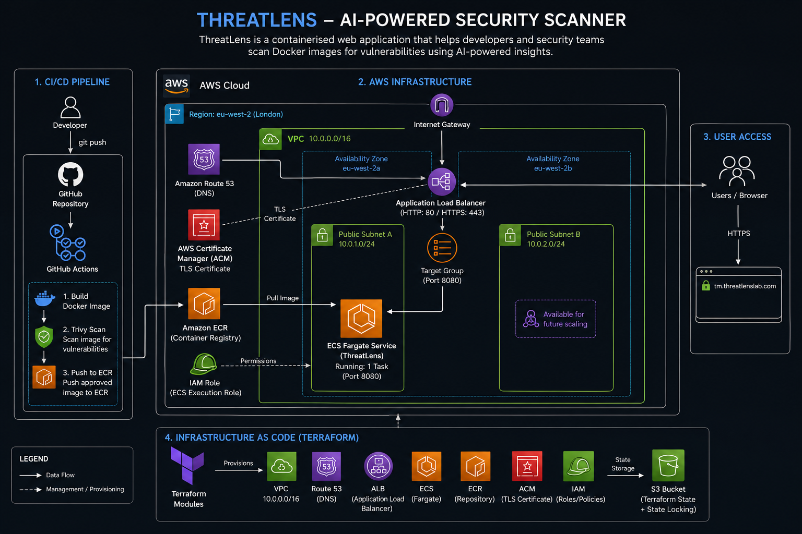
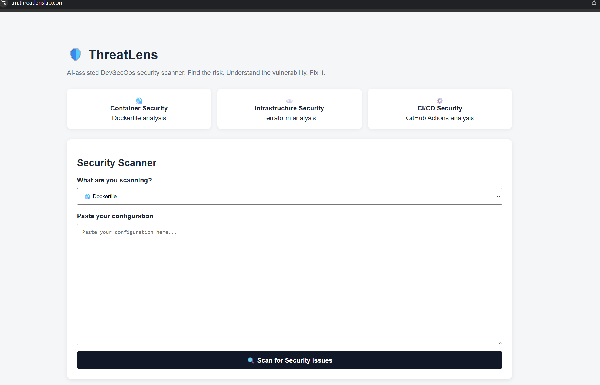
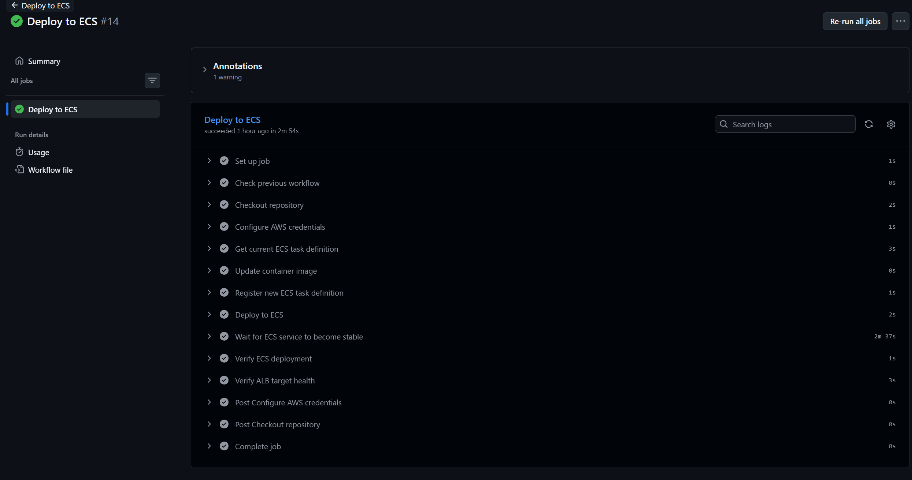
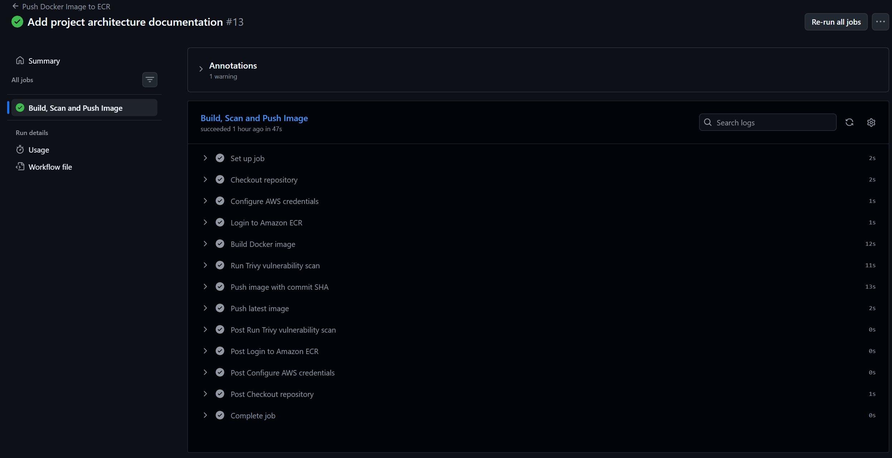
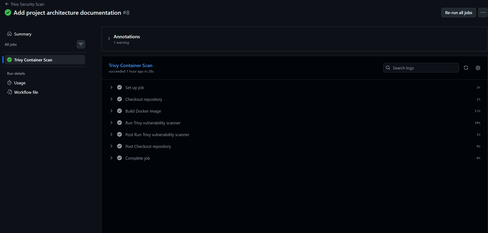
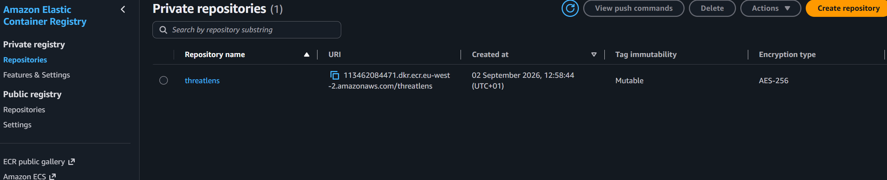
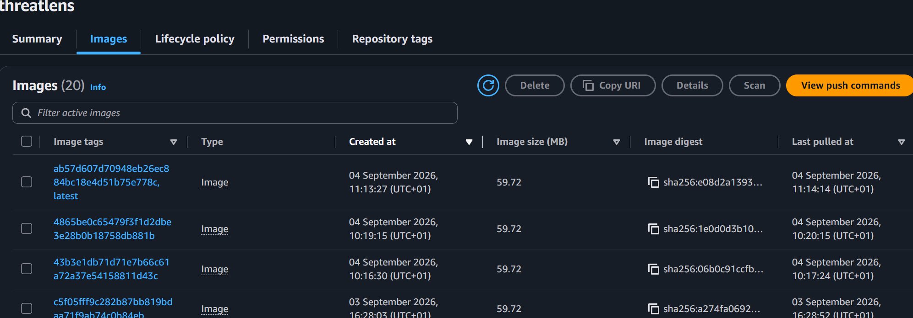
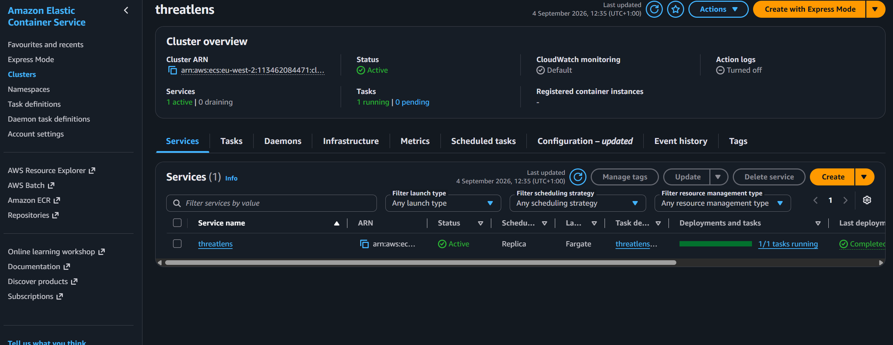
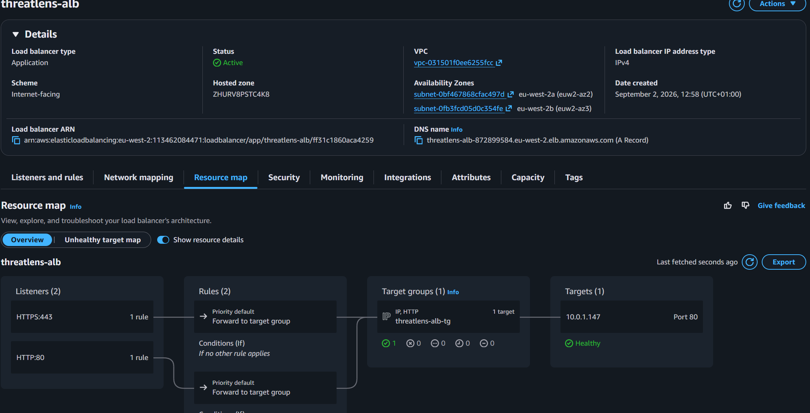

# ThreatLens 

### A containerised Flask application deployed to AWS using Terraform, Docker, ECS and GitHub Actions, with container security built into the CI/CD workflow.

[](https://aws.amazon.com/)
[](https://www.terraform.io/)
[](https://www.docker.com/)
[](https://aws.amazon.com/ecs/)
[](https://aws.amazon.com/ecr/)
[](https://github.com/features/actions)
[](https://trivy.dev/)
[](https://www.python.org/)
[](https://aws.amazon.com/route53/)
[](https://aws.amazon.com/certificate-manager/)

**Live application:** https://tm.threatlenslab.com

---

##  Project Overview

ThreatLens is a hands-on DevSecOps project built around a small Flask application and deployed to AWS.

The project takes the application through a complete workflow:

**Code → Docker → Security Scan → Amazon ECR → Amazon ECS → Load Balancer → HTTPS**

The infrastructure is managed using Terraform, while GitHub Actions automates the CI/CD process. Trivy is included in the pipeline to scan the container image for known vulnerabilities before deployment.

The application is publicly accessible through a custom domain over HTTPS.

## Architecture

The diagram below shows the AWS infrastructure, CI/CD pipeline,
container security scanning and Terraform workflow used to deploy ThreatLens.



---

##  What I Wanted to Build

Rather than building the application and infrastructure separately, I wanted to bring the different parts of a DevSecOps workflow together.

The project gave me practical experience with:

* Infrastructure as Code
* Containerisation
* AWS networking
* ECS deployments
* Container registries
* CI/CD
* IAM and GitHub OIDC
* Container vulnerability scanning
* HTTPS and DNS
* Terraform remote state
* Troubleshooting real deployment issues

---

##  Architecture

```text
                         GitHub
                           │
                           ▼
                    GitHub Actions
                           │
              ┌────────────┴────────────┐
              │                         │
          Docker Build                Trivy
              │                    Security Scan
              │                         │
              └────────────┬────────────┘
                           │
                           ▼
                      Amazon ECR
                           │
                           ▼
                      Amazon ECS
                           │
                           ▼
                Application Load Balancer
                           │
                           ▼
                  HTTPS / ACM Certificate
                           │
                           ▼
                       Route 53
                           │
                           ▼
                tm.threatlenslab.com
```

### AWS Network

The application is deployed inside a dedicated VPC in:

```text
eu-west-2 (London)
```

VPC:

```text
10.0.0.0/16
```

Public subnets:

```text
eu-west-2a
10.0.0.0/24

eu-west-2b
10.0.1.0/24
```

The VPC contains:

* Internet Gateway
* Public route table
* Two public subnets
* Application Load Balancer
* ECS service
* Security groups


---

##  AWS Services

### Amazon ECS

The Flask application runs as a container using Amazon ECS.

The deployment includes:

* ECS cluster
* ECS task definition
* ECS service
* ECS execution role
* ECS security group

The ECS service is connected to the Application Load Balancer target group.

### Amazon ECR

The Docker image is stored in an ECR repository named:

```text
threatlens
```

Image:

```text
113462084471.dkr.ecr.eu-west-2.amazonaws.com/threatlens:latest
```

### Application Load Balancer

The ALB provides the public entry point for the application.

Traffic is forwarded from the load balancer to the ECS service through the target group.

The target health check is configured against the application and currently reports the ECS target as **healthy**.

### Route 53

Route 53 provides DNS for the custom application domain.

```text
tm.threatlenslab.com
```

### AWS Certificate Manager

ACM provides the TLS certificate used by the HTTPS listener.

This allows the application to be accessed securely over HTTPS.

---

##  Application

ThreatLens is a lightweight Flask application written in Python.

The application exposes two main routes:

```text
/
```

and:

```text
/health
```

The health endpoint returns:

```json
{
  "status": "ok"
}
```

The application listens on port `8080` inside the container.

---

##  Running Locally

Clone the repository and move into the project:

```bash
git clone <your-repository-url>
cd ThreatLens
```

Create and activate a virtual environment:

```bash
python -m venv .venv
```

Windows:

```bash
source .venv/Scripts/activate
```

Install the dependencies:

```bash
pip install -r app/requirements.txt
```

Run the application:

```bash
python app/app.py
```

The application should then be available at:

```text
http://localhost:8080
```

Health check:

```bash
curl http://localhost:8080/health
```

---

##  Docker

The application is packaged into a Docker image for consistent deployment.

Build:

```bash
docker build -t threatlens:dev .
```

Run:

```bash
docker run -p 8080:8080 threatlens:dev
```

Then visit:

```text
http://localhost:8080
```

Health check:

```bash
curl http://localhost:8080/health
```

---

##  CI/CD

GitHub Actions is used to automate the build and deployment workflow.

The pipeline is designed around the following process:

```text
Push to GitHub
      │
      ▼
Checkout
      │
      ▼
Authenticate to AWS
      │
      ▼
Build Docker Image
      │
      ▼
Run Trivy Scan
      │
      ▼
Push Image to ECR
      │
      ▼
Terraform
      │
      ▼
ECS Deployment
```

The workflow uses GitHub OIDC to authenticate to AWS rather than storing long-lived AWS access keys inside GitHub.

This was an important part of the project because it keeps AWS credentials out of the repository and allows GitHub Actions to assume a dedicated IAM role.

---

##  Container Security

### Trivy

Trivy is integrated into the CI/CD workflow to scan the Docker image for known vulnerabilities.

I also used Trivy locally during development:

```bash
trivy image threatlens:dev
```

The scan helped identify vulnerabilities within the image and gave me a better understanding of the security implications of the packages included in a container.

Security scanning is therefore part of the workflow rather than something checked manually after deployment.

---

##  IAM & GitHub OIDC

GitHub Actions assumes a dedicated AWS IAM role:

```text
threatlens-github-actions-role
```

The ECS task uses a separate execution role:

```text
threatlens-ecs-execution-role
```

Separating these roles keeps the CI/CD permissions separate from the permissions required by the ECS task.

---

## Infrastructure as Code

Terraform is used to create and manage the AWS infrastructure.

The infrastructure is split into modules rather than keeping everything inside one large Terraform file.

```text
infra/
│
├── main.tf
├── provider.tf
├── variables.tf
├── outputs.tf
│
└── modules/
    ├── vpc/
    ├── ecr/
    ├── iam/
    ├── security-groups/
    ├── ecs/
    ├── alb/
    ├── acm/
    └── route53/
```

Common Terraform commands used during development:

```bash
terraform init
terraform fmt
terraform validate
terraform plan
terraform apply
```

Terraform state is stored remotely using an Amazon S3 backend.

---

##  Remote Terraform State

The project uses an S3 backend rather than relying solely on local Terraform state.

This allows the infrastructure state to be maintained independently from the local development environment and accessed by the CI/CD workflow.

Using remote state also helped me understand the additional AWS permissions required when Terraform runs from GitHub Actions.

---

#  Challenges & Troubleshooting

One of the most useful parts of the project was dealing with issues during deployment.

The infrastructure didn't work perfectly on the first attempt, which gave me the opportunity to troubleshoot the AWS environment rather than simply following a successful deployment.

### VPC limit

I reached the AWS VPC limit after creating several VPCs during development.

I used AWS CLI commands to identify the existing VPCs, subnets and internet gateways and cleaned up resources that were no longer required.

**What I learned:** AWS resource limits can affect Terraform deployments, and understanding the dependency relationships between resources is important when cleaning up infrastructure.

### Existing AWS resources

Terraform initially attempted to create resources that already existed, including:

* ECR repository
* IAM role
* ALB target group

Instead of assuming the Terraform configuration was wrong, I checked the existing AWS resources and compared them with Terraform state.

**What I learned:** An AWS resource existing does not automatically mean Terraform is managing it.

### IAM permission errors

The GitHub Actions role initially lacked several permissions required by Terraform.

For example:

```text
ec2:AuthorizeSecurityGroupEgress
iam:ListRolePolicies
```

The pipeline failed with `AccessDenied` errors.

I investigated the failed actions and updated the IAM policy attached to the GitHub Actions role.

**What I learned:** Terraform requires permissions for both creating resources and reading/refreshing existing resources during a plan.

### S3 backend permissions

After moving Terraform state to S3, GitHub Actions initially received a `403 Forbidden` error when attempting to access the state file.

I updated the permissions for the GitHub Actions role so Terraform could access the remote state.

**What I learned:** Moving state to a remote backend introduces another part of the AWS permission model that needs to be accounted for.

### ECS / ALB health checks

During deployment, one ECS target entered a draining state while the replacement target was being registered.

After the new target started successfully, the ALB reported:

```text
State: healthy
```

The application then loaded correctly through the public HTTPS endpoint.

**What I learned:** ECS deployments and load balancer target registration can involve a transition period, so checking target health is important when troubleshooting an application that appears unavailable.

---

## 📸 Screenshots

The repository includes screenshots showing the actual deployment.

### Live Application



### GitHub Actions




### Trivy



### Amazon ECR




### Amazon ECS



### ALB Target Health



### Terraform

**
**.


---

##  Project Structure

```text
ThreatLens/
│
├── app/
│   ├── app.py
│   └── requirements.txt
│
├── docker/
│   └── Dockerfile
│
├── infra/
│   ├── main.tf
│   ├── provider.tf
│   ├── variables.tf
│   ├── outputs.tf
│   │
│   └── modules/
│       ├── vpc/
│       ├── ecr/
│       ├── iam/
│       ├── security-groups/
│       ├── ecs/
│       ├── alb/
│       ├── acm/
│       └── route53/
│
├── .github/
│   └── workflows/
│
├── .gitignore
└── README.md
```

---

## What I Learned

This project helped me move beyond learning individual DevOps tools and understand how they work together in a real deployment.

The main areas I gained practical experience in were:

* AWS networking
* Terraform and modular IaC
* Docker
* Amazon ECS
* Amazon ECR
* Application Load Balancers
* IAM
* GitHub OIDC
* GitHub Actions
* Route 53
* AWS Certificate Manager
* Terraform remote state
* Container security with Trivy
* Debugging AWS and Terraform issues

The troubleshooting was particularly useful because several failures were caused by things outside the immediate Terraform configuration, such as AWS resource limits, existing resources and IAM permissions.

---

##  Future Improvements

There are several areas I would improve if I continued developing the project:

* Add CloudWatch logging and monitoring
* Add ECS service autoscaling
* Introduce AWS WAF
* Move application secrets into AWS Secrets Manager
* Add more automated application tests
* Improve the container image and reduce its attack surface
* Introduce blue/green or rolling deployment improvements

---

##  Project Status

**Completed and deployed.**

The application is running on AWS and is available publicly over HTTPS.

 **Live application:**
https://tm.threatlenslab.com

---

## Author

**Faizan Akbar**

Hands-on DevSecOps / Cloud project focused on AWS, Infrastructure as Code, containers, CI/CD and security.

